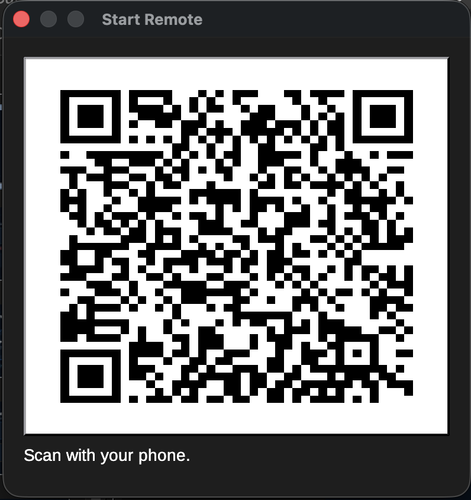
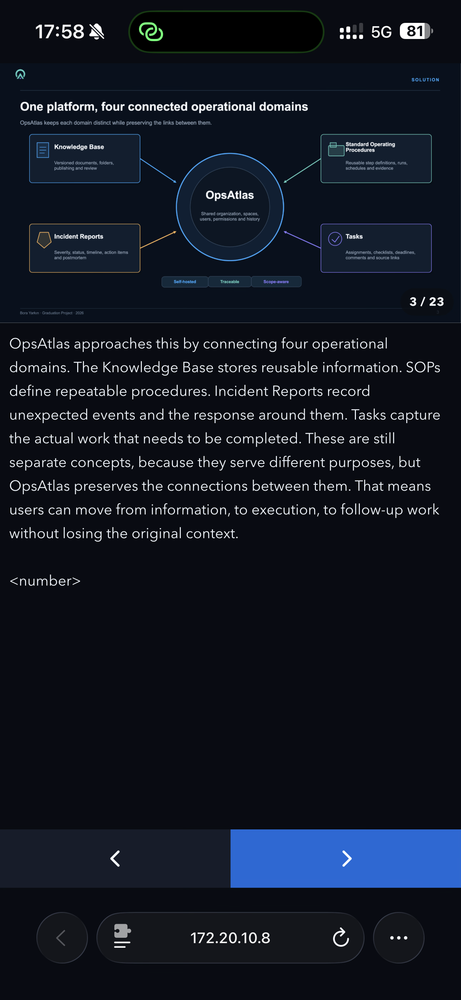
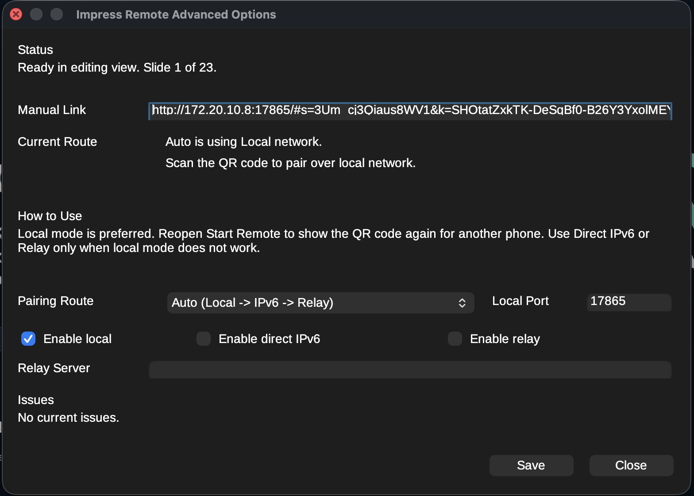

<!-- SPDX-FileCopyrightText: 2026 Bora Yarkın -->
<!-- SPDX-License-Identifier: GPL-3.0-only -->

# LibreOffice Impress Remote

LibreOffice Impress Remote turns your phone into a lightweight presenter remote for LibreOffice Impress. Start it from Impress, scan a QR code, and control the presentation from a clean phone UI that shows the current slide, presenter notes, and simple next/previous controls.

The extension is local-first. Same-Wi-Fi and many hotspot setups should work without extra infrastructure. Direct IPv6 and a self-hosted relay exist as fallback routes for harder networks.

> QR-first pairing popup from LibreOffice Impress.

> Phone remote with slide preview, presenter notes, and bottom-pinned controls.

> Advanced options dialog for route selection, relay configuration, and troubleshooting.

## What You Get

- A LibreOffice Impress extension, not a separate desktop app
- QR-first pairing from inside Impress
- A lightweight phone remote with current slide, notes, a timer, bottom next/previous controls, and compact icon-only presentation controls
- Local networking by default, with direct IPv6 and self-hosted relay fallbacks
- LibreOffice-owned settings, troubleshooting, and route selection

## Current Status

Version `0.6.19` is a usable pre-1.0 build with:

- QR-first local pairing
- live current-slide rendering
- presenter notes on the phone
- phone-side presentation timer and compact icon-only controls for start/end, effect steps, blank/resume, last slide, and jump-to-slide
- LibreOffice-native remote controls and settings
- Impress-only Slide Show menu integration plus supported toolbar buttons near the built-in slideshow controls
- encrypted direct IPv6 and relay transport, plus encrypted local transport when Web Crypto is available, for presenter state, commands, and slide assets, including relay-hosted slide previews and relay admission control
- Safari-compatible authenticated local fallback for LAN browsers that do not expose Web Crypto on plain HTTP
- one shared phone-remote web UI source reused by the LibreOffice extension, the Python relay, and the Cloudflare relay bundle
- visible phone-side connection recovery, retry/reload actions, accessibility polish, and PWA shell metadata
- local-mode full-deck preview prewarming to reduce slide export stalls during navigation
- keyed user-facing strings with English and Turkish localization catalogs shared by LibreOffice and the phone UI
- build tooling for the full `.oxt`, source-only `.oxt`, stripped standalone Python relay bundle with service installers, and separate Cloudflare relay deployment bundle
- OXT-contained matching Python relay, Cloudflare relay, and documentation bundles exportable from Advanced Remote Settings
- relay session-status, reconnect replay, structured logs, and published self-hosting docs for testing relay mode as a real fallback path

Still in progress:

- expanding localization beyond the initial English and Turkish catalogs toward LibreOffice-wide language coverage
- GitHub release support that runs the standard workflows and, after they pass, publishes a GitHub release with the extension package and a stripped relay-server release artifact without bundled documentation
- broader LibreOffice UX polish and accessibility work

## How To Use It

1. Install the extension in LibreOffice.
2. Open `Slide Show -> Presentation Remote -> Start Remote`.
3. Scan the QR code with your phone.
4. Use `Advanced Remote Settings` from the same submenu when you want to change the route or relay configuration.

The default route is `Auto`, which tries:

1. local network
2. direct IPv6
3. relay server

## Why This Exists

This project is aiming for a fully FOSS, LibreOffice-friendly presenter remote that does not depend on a mandatory third-party cloud service. The long-term direction is to make the local-first experience strong enough to inform a real LibreOffice contribution.

## Technical Documentation

This README is intentionally product-focused. Technical details live in the linked docs:

- [Technical documentation index](docs/README.md)
- [User guide](docs/user-guide.md)
- [Feature matrix](docs/feature-matrix.md)
- [Troubleshooting](docs/troubleshooting.md)
- [Build and test setup](docs/development/getting-started.md)
- [Test before release](docs/test-before-release.md)
- [Architecture](docs/architecture.md)
- [LibreOffice upstream architecture](docs/libreoffice-upstream-architecture.md)
- [Protocol](docs/protocol.md)
- [Release readiness](docs/release-readiness.md)
- [Relay server](docs/relay-server.md)
- [Security model](docs/security/e2ee.md)
- [Roadmap](docs/roadmap.md)

## Contributing And Project Policy

- [Contributing](.github/CONTRIBUTING.md)
- [Security policy](.github/SECURITY.md)
- [Code of conduct](.github/CODE_OF_CONDUCT.md)
- [Governance](.github/GOVERNANCE.md)

## License

GPL-3.0-only. See `LICENSE` and `REUSE.toml`.
