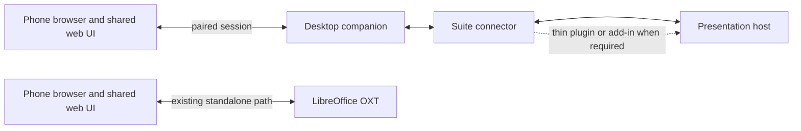

<!-- SPDX-FileCopyrightText: 2026 Bora Yarkın -->
<!-- SPDX-License-Identifier: GPL-3.0-only -->

# Cross-Suite Companion

**Status:** Proposal awaiting approval. This document authorizes no implementation by itself.

## Goal

Add an optional desktop companion for presenting with office suites other than
LibreOffice Impress. The companion should run on macOS, Windows, and Linux,
connect to a supported presentation host, and let a phone browser use the
project's shared remote UI. Browser-hosted office suites and Microsoft
PowerPoint are later targets. The project should add suites based on verified
capabilities rather than promise support for an undefined number of suites.

The first candidate family is ONLYOFFICE and Euro-Office, following the earlier
porting discussion. Their desktop and online products are separate targets and
must each be checked against their supported APIs and versions.

## Confirmed Direction

- The existing LibreOffice extension remains standalone. It must continue to
  start and serve the remote without the companion installed or running.
- The companion is for other presentation hosts; it is optional for LibreOffice
  users.
- Reuse the existing `shared/webui/` and `shared/localizations/` assets where
  they fit. Put new host-specific integration in separate connector code.
- Prefer the smallest supported host-side addition. Some suites may require a
  plugin, add-in, or browser extension; zero-install control is a goal to test,
  not a guarantee.
- Keep presentation data and phone traffic local by default. Do not introduce a
  project-operated cloud account or required relay service as part of the first
  companion scope. An online suite may still require its own account or service.
- Treat this as presentation control only. Word-processing and spreadsheet
  features are outside this plan.

## Current Repository Boundaries

Today, `shared/` contains the phone web UI and localization catalogs. The
LibreOffice implementation and its protocol/crypto modules are under
`extension/python/`; the local server constructs the UNO-bound Impress
controller directly. Those modules are not currently a standalone shared
library.

For the first companion milestone, do not move or rewrite the LibreOffice
extension, change its OXT packaging, or make it depend on the companion. Reuse
of existing protocol code must be proven without copying cryptographic code or
using UNO-only components. If clean reuse requires changes to the OXT source or
package, stop and bring that narrower compatibility change back for approval.

New connectors may be organized under `extensions/<host>/` as they are added.
Keep the existing `extension/` directory in place during this plan; moving it
to `extensions/libreoffice/` is a separate repository reorganization and is
not needed to build the companion.

## Proposed Architecture

The companion owns its process lifecycle, pairing/session, phone-facing
connection, and desktop packaging. A suite connector translates between the
host's supported API and a small presentation capability contract. A connector
may be an in-suite plugin/add-in, browser extension, or another documented
integration. It must not depend on private editor internals or direct DOM
patches.

The phone UI should continue to work in a normal mobile browser. The companion
should reuse its existing protocol when compatibility and security review
confirm that is practical. The current protocol implementation is not yet in
`shared/`, so the implementation plan must first establish a safe reuse seam
and preserve the existing LibreOffice workflow.

### Existing remote feature baseline

Phase 0 must inventory the complete current remote experience and record each
item as shared phone-UI behavior, host-dependent behavior, or connection-mode
behavior. The baseline includes current/next slide previews, presenter notes,
effect-aware previous/next controls, tap-to-advance, first/last/go-to-slide,
presentation and per-slide timers, fullscreen phone mode, QR/copy-link pairing,
and local Wi-Fi/hotspot use. It must also record the existing experimental
Direct IPv6, Relay Server, and LocalTunnel routes. No route or phone feature may
be silently presented as available for a companion connector unless verified.

The proposed first companion release focuses on the local network path. Phase 0
must explicitly recommend which existing experimental routes are technically
reusable and whether omitting them is an acceptable first-release gap. The user
must approve any known gap from the existing experience before that host is
described as feature-complete.

### Connector capabilities

Each connector should report which of these operations it actually supports:

- presentation started/ended and current slide identity/index;
- current and next slide preview;
- presenter notes;
- previous/next navigation, including animation/effect steps where the host
  exposes them;
- first, last, and go-to-slide navigation;
- pause/resume and presentation/slide timing where available;
- host/version identity and a clear status when a capability is unavailable.

The product should not imply feature parity when a host does not expose a
capability. Any gap from the existing phone remote must be visible in the
support matrix and accepted before that host is described as feature-complete.

## Integration Feasibility

| Candidate | Likely connector | What current official documentation establishes | What must be proven |
| --- | --- | --- | --- |
| ONLYOFFICE Desktop Editors | ONLYOFFICE plugin | Presentation plugin APIs document slide-show navigation and slide-show events. | Live slide preview and notes, animation-step behavior, pairing with the desktop companion, installation/distribution, and supported versions. |
| ONLYOFFICE Docs (online) | ONLYOFFICE plugin | The documented editor plugin API includes presentation slide-show commands/events. | Behavior in the actual hosted deployment, administrator/plugin distribution constraints, browser-origin rules, preview/notes, and animation steps. |
| Euro-Office Desktop Editors | Euro-Office-compatible plugin, if verified | Euro-Office's DesktopEditors project says its editors support plugins. | API/version compatibility with ONLYOFFICE, install path, slide-show behavior, preview/notes, and all supported OS builds. Do not infer compatibility from the shared codebase alone. |
| Euro-Office Docs (online) | Plugin or documented integration | Euro-Office publishes Document Server integration material. | Whether the presentation plugin API and necessary runtime hooks match the chosen connector in real deployments. |
| Microsoft PowerPoint | Office.js PowerPoint add-in | Microsoft documents PowerPoint add-ins across PowerPoint on the web, Windows, Mac, and iPad. | Active slide-show control/state, slide image access, notes, animation-step support, add-in distribution, and companion communication for each target host. |
| Google Slides | Browser extension plus Google APIs where suitable | Slides API documents reading speaker notes and generating page thumbnails. | Live show state/control, secure browser-to-companion communication, OAuth scope/consent, and whether API thumbnails are sufficiently current for the remote. |
| Other online suites | Evaluate individually | No general browser integration contract is assumed. | A supported public API or approved extension point, required installation, feature coverage, policy constraints, and testable versions. |

Current source links: [ONLYOFFICE presentation methods](https://api.onlyoffice.com/docs/plugins/interacting-with-editors/presentation-api/Methods/), [ONLYOFFICE presentation events](https://api.onlyoffice.com/docs/plugins/interacting-with-editors/presentation-api/Events/), [Euro-Office DesktopEditors](https://github.com/Euro-Office/DesktopEditors), [Euro-Office integration examples](https://github.com/Euro-Office/document-server-integration), [PowerPoint add-ins](https://learn.microsoft.com/en-us/office/dev/add-ins/powerpoint/), [Google Slides speaker notes](https://developers.google.com/workspace/slides/api/guides/notes), [Google Slides page thumbnails](https://developers.google.com/workspace/slides/api/reference/rest/v1/presentations.pages/getThumbnail).

These documents establish API surfaces, not end-to-end product compatibility.
The feasibility phase must check the exact product editions and versions used
for the proof of concept. In particular, the documentation reviewed so far does
not establish parity for animation-step navigation or live slideshow previews
across the candidate hosts.

## Ordered Development Plan

Development starts only after the user approves this plan. Approval starts
Phase 0; it does not pre-approve an expanded product scope or a new dependency.

### Phase 0 — Feasibility and go/no-go

1. Build a versioned capability matrix for ONLYOFFICE Desktop Editors,
   ONLYOFFICE Docs, Euro-Office DesktopEditors, and Euro-Office Docs, including
   the existing remote feature and connection-mode baseline.
2. Prototype only documented APIs for slideshow start/end, active slide
   tracking, next/previous and effect steps, notes, preview images, and
   communication with a local companion process.
3. Record plugin/add-in installation requirements and any browser, admin,
   network, account, or edition constraints for each target.
4. Check that the existing phone UI and protocol can be served by a standalone
   app without changing the LibreOffice package or duplicating cryptographic
   code.
5. Return a go/no-go report with demonstrated capabilities, missing features,
   platform needs, framework/packaging recommendation, security boundaries,
   and estimated implementation slices.

**Gate:** Stop if a core feature requires private APIs, editor DOM patching,
copied cryptography, or a material change to the LibreOffice OXT. Propose the
smallest alternative and get approval before crossing that boundary.

### Phase 1 — Contracts and runtime design

1. Define a small, versioned connector contract based on Phase 0 evidence.
2. Decide how the connector reaches the companion (for example, a local
   authenticated socket or browser native messaging) based on the actual hosts.
3. Threat-model pairing, LAN exposure, browser origins, plugin messages,
   authentication tokens, local storage, logging, and shutdown behavior.
4. Define the minimum desktop interaction for starting/stopping the companion,
   showing pairing QR/copy URL, selecting or diagnosing a connector, and
   reporting failures.
5. Compare a packaged Python service with desktop shells only if the required
   desktop interaction needs a native window, tray/menu integration, or
   installer behavior that a background service cannot provide.
6. Select packaging per OS. A shared codebase still needs platform-specific
   build artifacts; it does not imply one binary runs unchanged on all three
   operating systems.

**Gate:** Approve the connector contract, desktop interaction model, transport,
packaging choice, dependency list, and security design before product code
begins.

### Phase 2 — Companion foundation

1. Add a standalone companion runtime for macOS, Windows, and Linux.
2. Add pairing and lifecycle handling, phone UI delivery, protocol/session
   handling, diagnostics, and clean shutdown.
3. Keep local-network access opt-in and protected by the pairing/session
   protocol; do not expose an unauthenticated control endpoint.
4. Package and verify the app on each operating system, including install,
   launch, upgrade, and uninstall behavior.

**Gate:** No office connector is called supported until the app starts, pairs,
serves the phone UI, rejects unpaired commands, and shuts down cleanly on each
claimed OS.

### Phase 3 — First suite connectors

1. Implement the approved ONLYOFFICE connector against the supported API.
2. Validate Euro-Office independently against the same contract; maintain a
   separate compatibility entry if its behavior/version support differs.
3. Verify slide state, preview, notes, navigation, effect steps, reconnects,
   and host start/end behavior with real presentations and real editor builds.
4. Document connector installation and per-feature limitations.

**Gate:** A host is supported only for exact tested product editions/versions
and the capabilities demonstrated by the integration evidence.

### Phase 4 — Microsoft Office and browser-hosted suites

1. Prototype a PowerPoint Office.js add-in for the web, Windows, and Mac hosts.
   Add other PowerPoint platforms only after their APIs and test environments
   are verified.
2. Prototype a browser extension for Google Slides. Use Slides APIs only for
   operations they document; prove active-show control/state separately.
3. Add further online suites one at a time using documented APIs or supported
   extension points, with installation and privacy constraints recorded.

**Gate:** Each connector must pass the same capability, security, and version
support criteria as the first connectors. Do not advertise blanket “most office
suites” support without a published, tested host matrix.

### Phase 5 — Release and maintenance

1. Build signed or otherwise verifiable OS-specific installers where the
   selected distribution channels support them.
2. Verify clean install, upgrade, uninstall, firewall prompts, phone pairing,
   suite integration, and recovery from a crashed/restarted host on each OS.
3. Publish a compatibility matrix, setup instructions, privacy/networking
   description, and support boundaries.
4. Add a host to the supported list only while there is a maintainer and a
   repeatable compatibility check for it.

## Security and Privacy Requirements

- Pairing must authorize the phone before it can issue presentation commands.
- Validate every connector message and every command at the companion boundary.
- Do not let arbitrary webpages or untrusted content scripts invoke privileged
  controls.
- Bind listeners to the narrowest interfaces needed and defend against
  cross-origin requests, DNS rebinding, replay, and local-network abuse.
- Do not log slide images, presenter notes, pairing secrets, access tokens, or
  full command payloads.
- Keep any optional relay out of the first release unless a confirmed
  requirement and a separate security/operations plan justify it.
- Use supported suite APIs; do not scrape private DOM state or bypass host
  security controls.

## Acceptance Criteria

The companion work is complete only when all of the following are true:

1. The existing LibreOffice OXT still works independently, with its existing
   install/start/pair/control path and no companion dependency.
2. The companion installs, launches, pairs, and shuts down on macOS, Windows,
   and Linux. Each suite's support matrix lists only the OS/host combinations
   verified directly.
3. A phone browser can pair and receive live slide state and the approved
   preview/notes/navigation capabilities over the documented local path.
4. Unpaired or invalid commands are rejected; logs and diagnostics do not
   reveal slide content, notes, or pairing material.
5. Every supported host/version has direct integration evidence for its
   listed capabilities, and known gaps are shown in the compatibility matrix.
6. Browser-hosted and Microsoft Office connectors are separately verified
   before being advertised; their support is not implied by a desktop connector.

## Approval Boundary

This plan is ready for review. Approving it starts Phase 0 feasibility work.
The project should return with that phase's evidence and recommendations before
the companion's production architecture and implementation scope are locked.

## References

- [ONLYOFFICE Presentation API methods](https://api.onlyoffice.com/docs/plugins/interacting-with-editors/presentation-api/Methods/)
- [ONLYOFFICE Presentation API events](https://api.onlyoffice.com/docs/plugins/interacting-with-editors/presentation-api/Events/)
- [Euro-Office DesktopEditors](https://github.com/Euro-Office/DesktopEditors)
- [Euro-Office Document Server integration examples](https://github.com/Euro-Office/document-server-integration)
- [Microsoft PowerPoint add-ins](https://learn.microsoft.com/en-us/office/dev/add-ins/powerpoint/)
- [Google Slides speaker notes](https://developers.google.com/workspace/slides/api/guides/notes)
- [Google Slides page thumbnails](https://developers.google.com/workspace/slides/api/reference/rest/v1/presentations.pages/getThumbnail)
- [Chrome extension native messaging](https://developer.chrome.com/docs/extensions/develop/concepts/native-messaging)
- [PyInstaller: building for multiple operating systems](https://pyinstaller.org/en/latest/usage.html#supporting-multiple-operating-systems)
