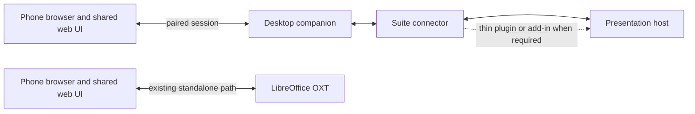

<!-- SPDX-FileCopyrightText: 2026 Bora Yarkın -->
<!-- SPDX-License-Identifier: GPL-3.0-only -->

# Cross-Suite Companion

**Status:** The Python companion shell with a local browser setup page is approved and in progress (2026-09-28). Live office-host testing is deferred; connector and phone transport remain gated on security and compatibility decisions.

## Goal

Add an optional desktop companion for presenting with office suites other than
LibreOffice Impress. The companion should run on macOS, Windows, and Linux,
connect to a supported presentation host, and let a phone browser use the
project's shared remote UI. Browser-hosted office suites and Microsoft
PowerPoint are later targets. The project should add suites based on verified
capabilities rather than promise support for an undefined number of suites.

The first candidate family is ONLYOFFICE and Euro-Office, following the earlier
porting discussion. Their desktop and online products are separate targets and
must each be checked against their supported APIs and versions.

## Confirmed Direction

- The existing LibreOffice extension remains standalone. It must continue to
  start and serve the remote without the companion installed or running.
- The companion is for other presentation hosts; it is optional for LibreOffice
  users.
- Reuse the existing `shared/webui/` and `shared/localizations/` assets where
  they fit. Put new host-specific integration in separate connector code.
- Prefer the smallest supported host-side addition. Some suites may require a
  plugin, add-in, or browser extension; zero-install control is a goal to test,
  not a guarantee.
- Keep presentation data and phone traffic local by default. Do not introduce a
  project-operated cloud account or required relay service as part of the first
  companion scope. An online suite may still require its own account or service.
- Treat this as presentation control only. Word-processing and spreadsheet
  features are outside this plan.
- The selected companion shell is a Python executable that opens a local setup
  page in the default browser. The setup server is a desktop-only surface; it
  does not itself expose presentation control to the phone.

## Current Repository Boundaries

Today, `shared/` contains the phone web UI and localization catalogs. The
LibreOffice implementation and its protocol/crypto modules are under
`extension/python/`; the local server constructs the UNO-bound Impress
controller directly. Those modules are not currently a standalone shared
library.

For the first companion milestone, do not move or rewrite the LibreOffice
extension, change its OXT packaging, or make it depend on the companion. Reuse
of existing protocol code must be proven without copying cryptographic code or
using UNO-only components. If clean reuse requires changes to the OXT source or
package, stop and bring that narrower compatibility change back for approval.

New connectors may be organized under `extensions/<host>/` as they are added.
Keep the existing `extension/` directory in place during this plan; moving it
to `extensions/libreoffice/` is a separate repository reorganization and is
not needed to build the companion.

## Proposed Architecture

The companion owns its process lifecycle, pairing/session, phone-facing
connection, and desktop packaging. A suite connector translates between the
host's supported API and a small presentation capability contract. A connector
may be an in-suite plugin/add-in, browser extension, or another documented
integration. It must not depend on private editor internals or direct DOM
patches.

The phone UI should continue to work in a normal mobile browser. The companion
should reuse its existing protocol when compatibility and security review
confirm that is practical. The current protocol implementation is not yet in
`shared/`, so the implementation plan must first establish a safe reuse seam
and preserve the existing LibreOffice workflow.

### Existing remote feature baseline

Phase 0 must inventory the complete current remote experience and record each
item as shared phone-UI behavior, host-dependent behavior, or connection-mode
behavior. The baseline includes current/next slide previews, presenter notes,
effect-aware previous/next controls, tap-to-advance, first/last/go-to-slide,
presentation and per-slide timers, fullscreen phone mode, QR/copy-link pairing,
and local Wi-Fi/hotspot use. It must also record the existing experimental
Direct IPv6, Relay Server, and LocalTunnel routes. No route or phone feature may
be silently presented as available for a companion connector unless verified.

The proposed first companion release focuses on the local network path. Phase 0
must explicitly recommend which existing experimental routes are technically
reusable and whether omitting them is an acceptable first-release gap. The user
must approve any known gap from the existing experience before that host is
described as feature-complete.

### Connector capabilities

Each connector should report which of these operations it actually supports:

- presentation started/ended and current slide identity/index;
- current and next slide preview;
- presenter notes;
- previous/next navigation, including animation/effect steps where the host
  exposes them;
- first, last, and go-to-slide navigation;
- pause/resume and presentation/slide timing where available;
- host/version identity and a clear status when a capability is unavailable.

The product should not imply feature parity when a host does not expose a
capability. Any gap from the existing phone remote must be visible in the
support matrix and accepted before that host is described as feature-complete.

## Integration Feasibility

| Candidate | Likely connector | What current official documentation establishes | What must be proven |
| --- | --- | --- | --- |
| ONLYOFFICE Desktop Editors | ONLYOFFICE plugin | Presentation plugin APIs document slide-show navigation and slide-show events. | Live slide preview and notes, animation-step behavior, pairing with the desktop companion, installation/distribution, and supported versions. |
| ONLYOFFICE Docs (online) | ONLYOFFICE plugin | The documented editor plugin API includes presentation slide-show commands/events. | Behavior in the actual hosted deployment, administrator/plugin distribution constraints, browser-origin rules, preview/notes, and animation steps. |
| Euro-Office Desktop Editors | Euro-Office-compatible plugin, if verified | Euro-Office's DesktopEditors project says its editors support plugins. | API/version compatibility with ONLYOFFICE, install path, slide-show behavior, preview/notes, and all supported OS builds. Do not infer compatibility from the shared codebase alone. |
| Euro-Office Docs (online) | Plugin or documented integration | Euro-Office publishes Document Server integration material. | Whether the presentation plugin API and necessary runtime hooks match the chosen connector in real deployments. |
| Microsoft PowerPoint | Office.js PowerPoint add-in | Microsoft documents PowerPoint add-ins across PowerPoint on the web, Windows, Mac, and iPad. | Active slide-show control/state, slide image access, notes, animation-step support, add-in distribution, and companion communication for each target host. |
| Google Slides | Browser extension plus Google APIs where suitable | Slides API documents reading speaker notes and generating page thumbnails. | Live show state/control, secure browser-to-companion communication, OAuth scope/consent, and whether API thumbnails are sufficiently current for the remote. |
| Other online suites | Evaluate individually | No general browser integration contract is assumed. | A supported public API or approved extension point, required installation, feature coverage, policy constraints, and testable versions. |

Current source links: [ONLYOFFICE presentation methods](https://api.onlyoffice.com/docs/plugins/interacting-with-editors/presentation-api/Methods/), [ONLYOFFICE presentation events](https://api.onlyoffice.com/docs/plugins/interacting-with-editors/presentation-api/Events/), [Euro-Office DesktopEditors](https://github.com/Euro-Office/DesktopEditors), [Euro-Office integration examples](https://github.com/Euro-Office/document-server-integration), [PowerPoint add-ins](https://learn.microsoft.com/en-us/office/dev/add-ins/powerpoint/), [Google Slides speaker notes](https://developers.google.com/workspace/slides/api/guides/notes), [Google Slides page thumbnails](https://developers.google.com/workspace/slides/api/reference/rest/v1/presentations.pages/getThumbnail).

These documents establish API surfaces, not end-to-end product compatibility.
The feasibility phase must check the exact product editions and versions used
for the proof of concept. In particular, the documentation reviewed so far does
not establish parity for animation-step navigation or live slideshow previews
across the candidate hosts.

## Phase 0 Execution Record

The user approved starting Phase 0 on 2026-09-28. The first code slice is the
development probe in `extensions/onlyoffice/`; it targets documented ONLYOFFICE
plugin and Office JavaScript APIs. It is not a connector implementation or a
compatibility claim.

### Host and version matrix

No product versions have been selected or tested yet. The matrix records the
evidence currently available so undocumented compatibility is not mistaken for
support.

| Host | Version/build checked | API and installation evidence | Live result |
| --- | --- | --- | --- |
| ONLYOFFICE Desktop Editors | None selected | Official plugin docs describe desktop `.plugin` installation and the presentation APIs used by the probe. The SDK script is loaded from the official plugin SDK URL. | Not tested in an installed host. |
| ONLYOFFICE Docs | None selected; deployment unknown | Official plugin docs describe presentation methods/events. Admin installation, cloud policy, host origins, and plugin distribution limits are not established. | Not tested in a Docs deployment. |
| Euro-Office DesktopEditors | None selected | The project documents plugin support. Its SDKJS repository describes an Office JavaScript API implementation, but the ONLYOFFICE `Asc.plugin` contract and presentation API parity have not been verified. The source build guide reviewed describes Windows and Linux builds; macOS status is unknown. | Not tested in an installed host. |
| Euro-Office Docs | None selected; deployment unknown | The official integration repository documents embedding Euro-Office Docs. The reviewed material does not establish the needed plugin installation and presentation API contract. | Not tested in a Docs deployment. |

Evidence: [ONLYOFFICE plugin methods](https://api.onlyoffice.com/docs/plugins/interacting-with-editors/presentation-api/Methods/), [ONLYOFFICE plugin events](https://api.onlyoffice.com/docs/plugins/interacting-with-editors/presentation-api/Events/), [ONLYOFFICE Desktop Editors plugin installation](https://api.onlyoffice.com/docs/plugins/development-workflow/developing/for-desktop-editors/), [Euro-Office DesktopEditors](https://github.com/Euro-Office/DesktopEditors), [Euro-Office SDKJS](https://github.com/Euro-Office/sdkjs), and [Euro-Office Docs integration examples](https://github.com/Euro-Office/document-server-integration).

| Capability | Current evidence | Phase 0 result |
| --- | --- | --- |
| Start/end, pause/resume, previous/next, go to slide | Documented ONLYOFFICE presentation plugin methods | Implemented as manual probe controls; live host behavior is not yet verified. |
| Active slide index and slideshow lifecycle | Documented `onSlideShowBegin`, `onSlideShowEnd`, and `onSlideShowSlideChanged` events | Implemented in the probe; live event behavior is not yet verified. |
| Slide count and editor slide index | Documented Office JavaScript API | Read by the probe; whether editor index tracks the active show is not assumed. |
| Presenter notes | Documented `GetNotesPage` and `GetBodyShapeText` APIs | Read and displayed for the reported slide index; live host behavior is not yet verified. |
| Whole-slide preview | The inspected plugin API documents image data for a selected drawing, not a rendered slide | No supported full-slide method established; unresolved feasibility gap. |
| Animation/effect steps | The inspected methods document slideshow navigation but do not specify effect-step semantics | Requires live test; unresolved. |
| Companion communication | No transport or trust design has been selected | Not implemented pending the Phase 1 security and interface decision. |
| Euro-Office compatibility | Shared lineage is not sufficient evidence of API compatibility | Unverified; inspect and test its exact editions and versions independently. |
| Shared phone UI and existing network modes | `shared/webui/app.js` expects local/direct HTTP routes, direct event streams and slide assets, or the relay WebSocket contract. The encrypted codec remains under `extension/python/`. | A companion server could serve the UI unchanged only if it implements the needed route contracts. Protocol reuse remains open; Direct IPv6, Relay, and LocalTunnel are not claimed reusable. |

### Shared phone UI contract inventory

This source-level inventory completes the Phase 0 baseline work that does not
require an installed host. It is inferred from `shared/webui/app.js`,
`shared/webui/index.html`, `extension/python/local_server.py`,
`extension/python/controller.py`, and `extension/python/protocol.py`; it is not
evidence that another host or a new companion already implements the contract.

| Surface | Existing contract | Ownership and companion implication |
| --- | --- | --- |
| Phone UI assets | `/`, `/index.html`, `/app.js`, `/app.css`, `/asset-manifest.json`, and `/localizations/<locale>.json` | Shared assets are host independent. The companion must serve the expected files and asset integrity metadata if reusing the UI unchanged. |
| Presentation state | JSON fields include `running`, `presentationActive`, `presentationPaused`, `documentKind`, `statusMessage`, zero-based `currentSlide`, `slideCount`, titles, `notes`, `nextSlide`, `nextTitle`, `nextPreview`, previous/next availability, `remainingSlides`, `atEndOfDeck`, `elapsedSeconds`, image revision identifiers, and current/next image URLs. | The connector must map host data into the phone UI's state fields. Unsupported values need explicit empty/unavailable behavior; field names and index semantics are compatibility-sensitive. |
| Phone commands | `previous_slide`, `next_slide`, `goto_first_slide`, `goto_last_slide`, and `goto_slide` with a zero-based `index` | LibreOffice implements previous/next with effect-step navigation before changing slides when UNO exposes it. The existing UI depends on that behavior, but the shared command name alone does not guarantee another suite has matching effect semantics. |
| Timers and phone interaction | Total time starts from `elapsedSeconds`; the phone starts a per-slide timer when `currentSlide` changes. Timer pause/resume is local to the phone UI. Fullscreen and tap-to-advance are also handled in the browser. | These controls do not require a host command beyond state updates and slide navigation. They should not be mistaken for host pause/resume or host-provided timing. |
| Local/IPv6 compatibility path | State and slide assets use `/api/local/state` and `/api/local/slide/{current,next}`; commands use `POST /api/local/command`. Requests carry session and pairing-secret headers. The UI polls state every 1.5 seconds when this fallback is active. | Existing behavior is authenticated plaintext under its current route restrictions. Reusing it in a companion requires a separate security decision; the current fallback is not a default design for new connectors. |
| Encrypted direct path | `GET /api/direct/handshake`, `POST /api/direct/handshake`, `/api/direct/state`, `/api/direct/events` (SSE), `/api/direct/slide/{current,next}`, and `POST /api/direct/command`. State, commands, and slide assets use versioned encrypted frames; the event stream sends `hello` and `state` events. | The protocol codec is implemented under `extension/python/` and imports the extension crypto/localization modules. Reuse must avoid copying crypto or changing the OXT as scoped above. |
| Relay path | `/api/session` reports admission-controlled session status; `/ws` carries `hello`, encrypted `frame`, and `error` envelopes. The relay forwards frames without decrypting them. | This route requires the relay admission and encrypted session protocol. The relay is not a local host connector or a generic substitute for a companion runtime. |
| Pairing and host lifecycle | LibreOffice owns the start/stop entry point, route selection, pairing QR/copy URL dialog, and listener setup. | These are extension-owned behaviors, not part of the shared phone UI. A companion needs its own approved desktop interaction and pairing lifecycle. |

The baseline separates three implementation areas: shared browser behavior and
assets; host-dependent state, previews, and effect-aware navigation; and
connection-mode pairing, transport, and security. Phase 0 live checks remain
deferred at the user's request. The matrix and API probe remain incomplete as
compatibility evidence until actual editions and versions are run.

Source inspection confirms `extension/python/protocol.py` has no UNO imports, but
it imports `crypto.py` and `localization.py`. `crypto.py` contains the project's
own AES-GCM and P-256 implementations because LibreOffice's embedded Python may
not include a crypto package. That code must not be copied or replaced as a
convenience. Moving it into `shared/` would change the OXT source/package, which
the current scope forbids. A single-source packaging/import seam and the use of
the existing protocol in a separate companion remain unresolved; no protocol or
LibreOffice source was changed in this phase slice.

The probe loads ONLYOFFICE's documented plugin SDK from its official plugin
SDK URL. The plugin SDK is executable code in the editor plugin context; runtime
source pinning/distribution and offline behavior remain part of the security and
packaging review. The probe does not contact a companion process, transmit notes,
or modify the LibreOffice extension or OXT.

This is an interim record, not the Phase 0 go/no-go report. The Python shell
shape is selected, but the frozen executable packaging tool, phone transport,
shared-code extraction seam, Euro-Office behavior, and real-host behavior
remain undecided or unverified.

## Ordered Development Plan

The user approved Phase 0 on 2026-09-28 and has asked to defer live-host testing
while development writing continues. This does not establish unverified host
compatibility or resolve the connector transport, desktop interaction,
packaging, dependency, or security decisions listed in Phase 1.

### Phase 0 — Feasibility and go/no-go

1. Build a versioned capability matrix for ONLYOFFICE Desktop Editors,
   ONLYOFFICE Docs, Euro-Office DesktopEditors, and Euro-Office Docs, including
   the existing remote feature and connection-mode baseline.
2. Prototype only documented APIs for slideshow start/end, active slide
   tracking, next/previous and effect steps, notes, preview images, and
   communication with a local companion process.
3. Record plugin/add-in installation requirements and any browser, admin,
   network, account, or edition constraints for each target.
4. Check that the existing phone UI and protocol can be served by a standalone
   app without changing the LibreOffice package or duplicating cryptographic
   code.
5. Return a go/no-go report with demonstrated capabilities, missing features,
   platform needs, framework/packaging recommendation, security boundaries,
   and estimated implementation slices.

**Gate:** Stop if a core feature requires private APIs, editor DOM patching,
copied cryptography, or a material change to the LibreOffice OXT. Propose the
smallest alternative and get approval before crossing that boundary.

### Phase 1 — Contracts and runtime design

1. Define a small, versioned connector contract based on Phase 0 evidence.
2. Decide how the connector reaches the companion (for example, a local
   authenticated socket or browser native messaging) based on the actual hosts.
3. Threat-model pairing, LAN exposure, browser origins, plugin messages,
   authentication tokens, local storage, logging, and shutdown behavior.
4. Define the local setup page's lifecycle, shutdown, diagnostics, and secure
   loopback-only access. Pairing and connector selection remain for a later
   approved slice.
5. Select and review a Python packaging tool before building frozen
   executables. Keep runtime dependencies empty until a confirmed capability
   requires one.
6. Package and verify separately for each OS. A shared codebase still needs
   platform-specific build artifacts; it does not imply one binary runs
   unchanged on all three operating systems.

**Gate:** The Python shell and local setup page are approved for implementation.
Office connector messages, phone-facing network access, pairing, cryptographic
protocol reuse, additional dependencies, and frozen OS packages remain gated
until their interfaces and security design are approved.

### Phase 2 — Companion foundation

1. Add a standalone companion runtime for macOS, Windows, and Linux.
2. Add pairing and lifecycle handling, phone UI delivery, protocol/session
   handling, diagnostics, and clean shutdown.
3. Keep local-network access opt-in and protected by the pairing/session
   protocol; do not expose an unauthenticated control endpoint.
4. Package and verify the app on each operating system, including install,
   launch, upgrade, and uninstall behavior.

**Gate:** No office connector is called supported until the app starts, pairs,
serves the phone UI, rejects unpaired commands, and shuts down cleanly on each
claimed OS.

### Phase 3 — First suite connectors

1. Implement the approved ONLYOFFICE connector against the supported API.
2. Validate Euro-Office independently against the same contract; maintain a
   separate compatibility entry if its behavior/version support differs.
3. Verify slide state, preview, notes, navigation, effect steps, reconnects,
   and host start/end behavior with real presentations and real editor builds.
4. Document connector installation and per-feature limitations.

**Gate:** A host is supported only for exact tested product editions/versions
and the capabilities demonstrated by the integration evidence.

### Phase 4 — Microsoft Office and browser-hosted suites

1. Prototype a PowerPoint Office.js add-in for the web, Windows, and Mac hosts.
   Add other PowerPoint platforms only after their APIs and test environments
   are verified.
2. Prototype a browser extension for Google Slides. Use Slides APIs only for
   operations they document; prove active-show control/state separately.
3. Add further online suites one at a time using documented APIs or supported
   extension points, with installation and privacy constraints recorded.

**Gate:** Each connector must pass the same capability, security, and version
support criteria as the first connectors. Do not advertise blanket “most office
suites” support without a published, tested host matrix.

### Phase 5 — Release and maintenance

1. Build signed or otherwise verifiable OS-specific installers where the
   selected distribution channels support them.
2. Verify clean install, upgrade, uninstall, firewall prompts, phone pairing,
   suite integration, and recovery from a crashed/restarted host on each OS.
3. Publish a compatibility matrix, setup instructions, privacy/networking
   description, and support boundaries.
4. Add a host to the supported list only while there is a maintainer and a
   repeatable compatibility check for it.

## Security and Privacy Requirements

- The desktop setup server must bind only to IPv4 loopback on an OS-assigned
  port. It must reject unexpected `Host` values and must not enable CORS.
- The setup page's shutdown action must require the exact same-origin and a
  per-run random token. The token must not appear in the URL or request logs.
- The initial shell must not expose a phone-facing listener or office-control
  endpoint.
- Pairing must authorize the phone before it can issue presentation commands.
- Validate every connector message and every command at the companion boundary.
- Do not let arbitrary webpages or untrusted content scripts invoke privileged
  controls.
- Bind listeners to the narrowest interfaces needed and defend against
  cross-origin requests, DNS rebinding, replay, and local-network abuse.
- Do not log slide images, presenter notes, pairing secrets, access tokens, or
  full command payloads.
- Keep any optional relay out of the first release unless a confirmed
  requirement and a separate security/operations plan justify it.
- Use supported suite APIs; do not scrape private DOM state or bypass host
  security controls.

## Acceptance Criteria

The companion work is complete only when all of the following are true:

1. The existing LibreOffice OXT still works independently, with its existing
   install/start/pair/control path and no companion dependency.
2. The companion installs, launches, pairs, and shuts down on macOS, Windows,
   and Linux. Each suite's support matrix lists only the OS/host combinations
   verified directly.
3. A phone browser can pair and receive live slide state and the approved
   preview/notes/navigation capabilities over the documented local path.
4. Unpaired or invalid commands are rejected; logs and diagnostics do not
   reveal slide content, notes, or pairing material.
5. Every supported host/version has direct integration evidence for its
   listed capabilities, and known gaps are shown in the compatibility matrix.
6. Browser-hosted and Microsoft Office connectors are separately verified
   before being advertised; their support is not implied by a desktop connector.

## Approval Boundary

The user approved Phase 0 and selected the Python executable with a local setup
page in the default browser on 2026-09-28. Live office-host checks are deferred
at the user's request. The approved implementation slice is the loopback-only
desktop shell; this does not approve office-control transport, phone network
exposure, cryptographic changes, new dependencies, or frozen installers.

## References

- [ONLYOFFICE Presentation API methods](https://api.onlyoffice.com/docs/plugins/interacting-with-editors/presentation-api/Methods/)
- [ONLYOFFICE Presentation API events](https://api.onlyoffice.com/docs/plugins/interacting-with-editors/presentation-api/Events/)
- [Euro-Office DesktopEditors](https://github.com/Euro-Office/DesktopEditors)
- [Euro-Office Document Server integration examples](https://github.com/Euro-Office/document-server-integration)
- [Microsoft PowerPoint add-ins](https://learn.microsoft.com/en-us/office/dev/add-ins/powerpoint/)
- [Google Slides speaker notes](https://developers.google.com/workspace/slides/api/guides/notes)
- [Google Slides page thumbnails](https://developers.google.com/workspace/slides/api/reference/rest/v1/presentations.pages/getThumbnail)
- [Chrome extension native messaging](https://developer.chrome.com/docs/extensions/develop/concepts/native-messaging)
- [PyInstaller: building for multiple operating systems](https://pyinstaller.org/en/latest/usage.html#supporting-multiple-operating-systems)
